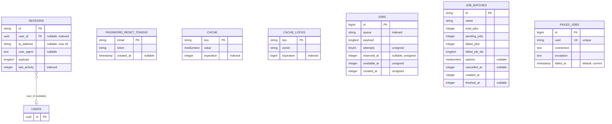

# KU HOME API — Database ER Diagram

> 📊 Entity Relationship Diagram สำหรับ KU HOME API
> อัปเดตล่าสุด: 2026-06-23 | สอดคล้องกับ commit `f657e49`

---

## 🏨 Core Business Domain

```mermaid
erDiagram
    USERS ||--o{ BOOKINGS : "user_id (who booked)"
    USERS ||--o{ HOUSEKEEPING_TASKS : "assigned_to"
    USERS ||--o{ PAYMENTS : "received_by"
    USERS ||--o{ PERSONAL_ACCESS_TOKENS : "tokenable_id"

    ROOM_TYPES ||--o{ ROOMS : "room_type_id"
    ROOM_TYPES ||--o{ BOOKING_ROOMS : "room_type_id"

    ROOMS ||--o{ HOUSEKEEPING_TASKS : "room_id"
    ROOMS ||--o{ BOOKING_ROOMS : "room_id (nullable, assign at check-in)"

    BOOKINGS ||--|{ BOOKING_ROOMS : "booking_id"
    BOOKINGS ||--o{ PAYMENTS : "booking_id"
    BOOKINGS ||--o{ RECEIPTS : "booking_id"

    BOOKING_ROOMS ||--o| ADDONS : "booking_room_id"

    PAYMENTS ||--o{ RECEIPTS : "payment_id"

    HOUSEKEEPING_TASKS ||--o{ HOUSEKEEPING_PHOTOS : "task_id"
    HOUSEKEEPING_TASKS ||--o{ HOUSEKEEPING_INVENTORIES : "task_id"

    USERS {
        uuid id PK
        string name
        string email UK "unique"
        string password "hashed"
        string role "default: user"
        string title "nullable"
        string phone "nullable"
        string nationality "default: Thai"
        boolean is_ku_member "default: false"
        boolean ver "default: false, verification flag"
        timestamp email_verified_at "nullable"
        remember_token remember_token
        timestamp created_at
        timestamp updated_at
    }

    ROOM_TYPES {
        uuid id PK
        string name_en
        string name_th
        integer max_guests
        boolean extra_bed_enabled "default: false"
        integer max_extra_beds "default: 0"
        integer extra_bed_price "default: 0"
        integer rate_daily_general
        timestamp created_at
        timestamp updated_at
    }

    ROOMS {
        uuid id PK
        uuid room_type_id FK
        string room_number UK "unique"
        string status "default: available (lowercase)"
        integer builtin_extra_beds "default: 0"
        timestamp status_updated_at "nullable"
        uuid status_updated_by "nullable, no FK"
        timestamp created_at
        timestamp updated_at
    }

    BOOKINGS {
        uuid id PK
        string confirmation UK "unique, nullable, format: YYYYMM-XXXXX"
        uuid user_id FK "nullable, who booked"
        string source "default: online"
        date check_in
        date check_out
        integer total_amount "satang/cents"
        boolean is_paid "default: false"
        timestamp payment_deadline "nullable"
        string status "default: draft"
        timestamp created_at
        timestamp updated_at
    }

    BOOKING_ROOMS {
        uuid id PK
        uuid booking_id FK
        uuid room_type_id FK
        uuid room_id FK "nullable, assigned at check-in"
        json guests "nullable, array of {title,name,nationality,is_ku_member}"
        integer children "default: 0"
        integer rate_daily "nullable"
        integer nights "nullable"
        timestamp created_at
        timestamp updated_at
    }

    ADDONS {
        uuid id PK
        uuid booking_room_id FK
        integer extra_bed "default: 0"
        integer breakfast "default: 0"
        integer early_checkIn_price "default: 0"
        integer late_checkOut_price "default: 0"
        integer extra_bed_price "default: 0"
        integer breakfast_price "default: 0"
        timestamp created_at
        timestamp updated_at
    }

    ADDON_RATES {
        uuid id PK
        string code UK "unique, e.g. extra_bed"
        string name_en
        string name_th "nullable"
        integer default_price "default: 0"
        boolean is_active "default: true"
        timestamp created_at
        timestamp updated_at
    }

    PAYMENTS {
        uuid id PK
        uuid booking_id FK
        integer amount "satang/cents (was decimal, changed 2026-06-05)"
        string payment_method "cash, credit_card, transfer"
        string status "default: completed"
        string reference_number "nullable"
        uuid received_by FK "nullable, staff who received"
        timestamp created_at
        timestamp updated_at
    }

    RECEIPTS {
        uuid id PK
        string receipt_no UK "unique, format: YYYYMM-XXXXX"
        uuid booking_id FK
        uuid payment_id FK
        integer amount "satang/cents (was decimal, changed 2026-06-05)"
        string billing_name "nullable"
        text billing_address "nullable"
        timestamp issued_at "default: current"
        timestamp created_at
        timestamp updated_at
    }

    HOUSEKEEPING_TASKS {
        uuid id PK
        uuid room_id FK
        uuid assigned_to FK "nullable, housekeeping staff"
        string status "default: pending"
        text notes "nullable"
        timestamp checked_out_at "nullable"
        timestamp completed_at "nullable"
        timestamp created_at
        timestamp updated_at
    }

    HOUSEKEEPING_PHOTOS {
        uuid id PK
        uuid task_id FK
        string photo_path "storage path"
        timestamp created_at
        timestamp updated_at
    }

    HOUSEKEEPING_INVENTORIES {
        uuid id PK
        uuid task_id FK
        string item_name "e.g. towel, minibar water"
        integer actual_quantity
        string condition "default: good"
        string notes "nullable"
        timestamp created_at
        timestamp updated_at
    }

    IMAGES {
        uuid id PK
        string url
        uuid imageable_id "nullable, polymorphic"
        string imageable_type "nullable, polymorphic"
        timestamp created_at
        timestamp updated_at
    }

    BOOKING_SEQUENCES {
        string key PK "YYYYMM format"
        integer last_number "default: 0"
        timestamp created_at
        timestamp updated_at
    }

    RECEIPT_SEQUENCES {
        string key PK "YYYYMM format"
        bigint last_number "default: 0"
        timestamp created_at
        timestamp updated_at
    }

    PERSONAL_ACCESS_TOKENS {
        bigint id PK
        uuid tokenable_id "polymorphic"
        string tokenable_type "polymorphic"
        text name
        string token UK "unique, 64 chars"
        text abilities "nullable"
        timestamp last_used_at "nullable"
        timestamp expires_at "nullable, indexed"
        timestamp created_at
        timestamp updated_at
    }
```

---

## 🔧 Laravel System Tables

---

## 📌 Notes

### 🌟 Key Design Decisions

1. **Guests as JSON** (`booking_rooms.guests`)
   - รองรับผู้เข้าพักหลายคนต่อห้อง
   - Format: `[{ "title": "Mr.", "name": "สมชาย", "nationality": "Thai", "is_ku_member": false }]`
   - Refactored: 2026-06-18 (ย้ายจาก `bookings` table)

2. **Amount as Integer** (satang/cents)
   - `payments.amount`, `receipts.amount`, `bookings.total_amount` ใช้ `integer` (satang/cents)
   - Changed: 2026-06-05 (จาก `decimal` เดิม)

3. **Addon Rates — Server-side Lookup**
   - `addon_rates` table เก็บ default prices
   - ไม่ trust client — server lookup rates ก่อนคำนวณ

4. **Sequence Counters**
   - `booking_sequences` / `receipt_sequences` — atomic counters สำหรับ generate confirmation/receipt numbers
   - Format: `YYYYMM-XXXXX`

5. **Polymorphic Images** 🚧
   - `images.imageable_id` + `images.imageable_type`
   - Status: DRAFT (ยังไม่สมบูรณ์)

### 🏷️ Status Enums

| Field | Valid Values |
|---|---|
| `bookings.status` | `draft`, `paid`, `confirmed`, `checked_in`, `checked_out`, `cancelled`, `no_show`, `deleted` |
| `rooms.status` | `available`, `occupied`, `checkout_makeup`, `dirty`, `prep_checkin`, `maintenance`, `reserved_closed` |
| `payments.status` | `pending`, `completed`, `failed` |
| `housekeeping_tasks.status` | `pending`, `in_progress`, `done` |
| `housekeeping_inventories.condition` | `good`, `damaged`, `missing` |
| `bookings.source` | `online`, `admin`, `line` |
| `users.role` | `user`, `guest`, `ku_member`, `staff`, `admin`, `housekeeping`, `system` |